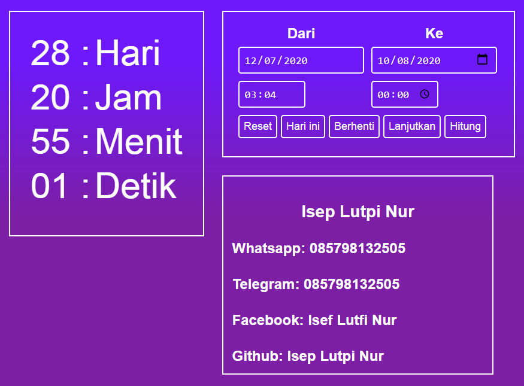
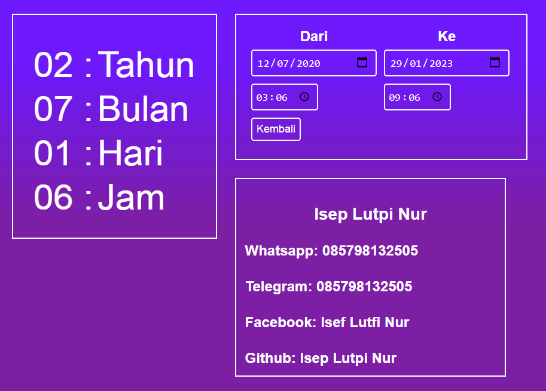

# Aplikasi Perhitungan waktu hitung mundur (countdown)
Aplikasi perhitungan waktu hitung mundur sederhana menggunakan javascript

https://iseplutpinur.github.io/countdown/

## Halaman utama

- Perhitungan mundur dengan waktu dari (waktu saat ini)  **Ke** Tanggal 10 Agustus.
- Kolom waktu **Ke** bisa di kostum ke tanggal yang di inginkan
- Reset
	- Merubah waktu  **Ke** Tanggal default yaitu 10 Agustus
	- Tapi tidak melanjutkan animasi backround
- Hari Ini
	- Merubah waktu  **Ke** Tanggal dan waktu saat ini
	- Bisa di kembalikan ke default menggunakan tombol **rest**
- Berhenti
	- Menghentikan waktu yang sedang menghitung mundur
	- Menghentikan animasi background
- Lanjutkan
	- Melanjutkan waktu yang sedang menghitung mundur
	- Melanjutkan animasi background
- Hitung: Untuk Beralih halaman ke halaman kostum
- Apabila waktu **dari** diubah dan telah melewati waktu **ke** Maka perhitungan mundur akan EXPIRED
- Apabila waktu **dari** telah melewati waktu **ke** Dengan sendirinya maka perhitungan mundur akan muncul pesan Selamat Ulang Tahun

## Halaman Kostum

- Kolom **ke** Dan **Dari** Bisa di costum sesuka hati
- Kembali: Untuk beralih halaman ke Halaman utama 

